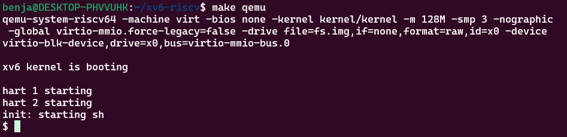
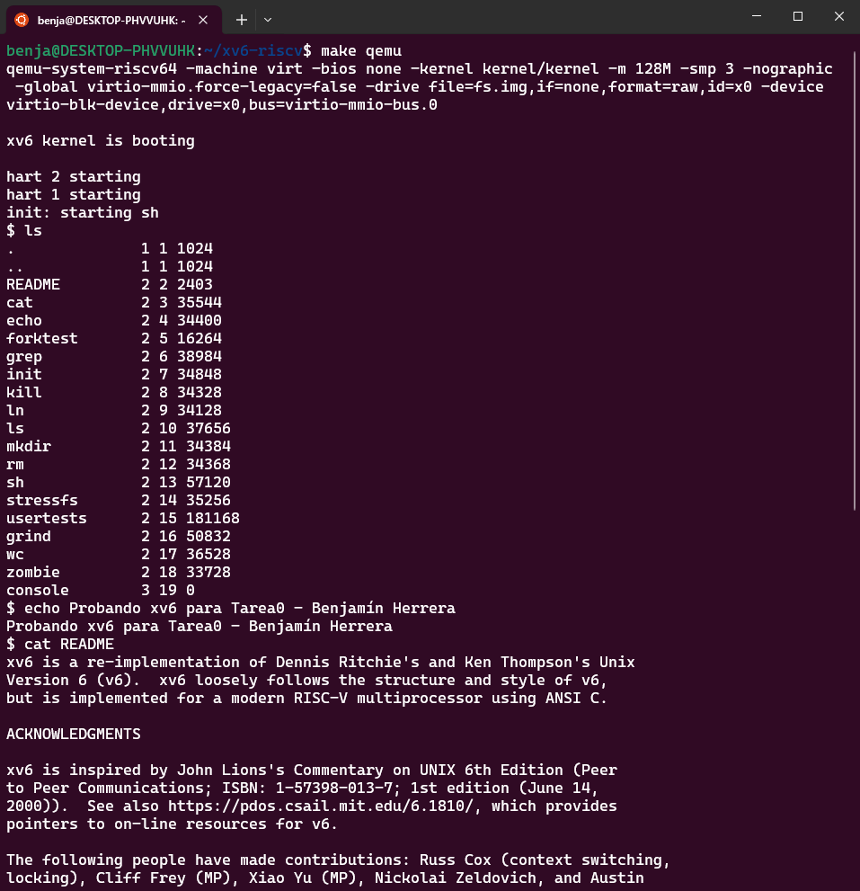

# Sistemas Operativos 2024/2 - Tarea 0 - Benjamín Herrera
El presente archivo documenta el paso a paso de la instalación del sistema operativo xv6, junto con aquellos problemas encontrados durante la instalación y las soluciones a estos. También se señalan algunas decisiones tomadas para llevar a cabo una instalación lo más cómoda posible.

# Instalación de Ubuntu
Descargué Ubuntu tanto para virtualizarlo bajo el programa VirtualBox de Oracle como también para utilizarlo como subsistema de Windows (WSL). A continuación, se describen ambos procedimientos.

## VirtualBox
1. Se descargó la imagen de Ubuntu, específicamente la versión **22.04.04** disponible en el sitio web oficial de la distro (https://releases.ubuntu.com/jammy/). Se escogió esta versión luego de que la versión más reciente actualmente disponible **(24.04)** presentara errores durante la obtención e instalación de paquetes, principalmente aquellos asociados a QEMU, aunque principalmente se debió porque WSL utiliza dicha versión *release*.
2. Utilizando el software VirtualBox y su asistente para crear VMs, se creó una nueva máquina virtual. Las características de esta VM son las siguientes, con tal de cumplir al menos con los requerimientos mínimos para ejecutar Ubuntu:
    * **Cantidad de procesadores:** 3 (esto fue decisión propia; se puede usar 2 o más de 3 también)
    * **Memoria RAM:** 4GB
    * **Disco Duro Virtual:** 64GB
3. Se inicia el proceso de instalación de Ubuntu como sistema operativo de la máquina virtual (10-20 minutos). Una vez terminada la instalación, se reinicia la máquina y se extrae el archivo de imagen utilizado, para de esta forma acceder a Ubuntu.
4. Una vez ingresadas las credenciales de usuario, ya estamos dentro del sistema y listos para llevar a cabo la tarea descrita.

## WSL
*Se asume de antemano que WSL ya está habilitado en Windows. Me encuentro utilizando Windows 10, por lo que algunos pasos que sean exclusivos de este sistema se señalarán con **(W10)**.*
1. Se descargó Ubuntu de la Microsoft Store. La versión instalada corresponde a la **22.04.03** de dicha distro, por lo cual tanto la VM como WSL comparten la misma versión *release*.
2. **(W10)** Se instala Windows Terminal, la cual permite trabajar de manera más cómoda con Ubuntu.
3. Ejecutamos Windows Terminal. Luego, abrimos una nueva pestaña, y seleccionamos Ubuntu, lo cual nos guiará en la configuración de usuario. Una vez hecho esto, WSL estará listo para ser usado.

# Instalación del toolchain (riscv-gnu-toolchain)
1. Actualizamos la lista de paquetes disponibles: `sudo apt-get update`
2. Instalamos git: `sudo apt-get install git`
3. Clonamos el repositorio del toolchain: `git clone https://github.com/riscv/riscv-gnu-toolchain`
4. Accedemos a la carpeta creada por el paso anterior: `cd riscv-gnu-toolchain`
5. Instalamos los prerequisitos explicitados en el repositorio de riscv-gnu-toolchain para construir el toolchain. Este proceso puede tardar alrededor de un minuto: `sudo apt-get install autoconf automake autotools-dev curl python3 python3-pip libmpc-dev libmpfr-dev libgmp-dev gawk build-essential bison flex texinfo gperf libtool patchutils bc zlib1g-dev libexpat-dev ninja-build git cmake libglib2.0-dev libslirp-dev`
6. Configuramos el entorno: `./configure --prefix=/usr/local`
7. Construimos el toolchain (**OJO: LA CONSTRUCCIÓN PUEDE TARDAR ALREDEDOR DE 60-90 MIN.**): `sudo make`

# Instalación de QEMU
1. Obtenemos QEMU. Se utilizará la versión 7.2.0 debido a que versiones posteriores presentaron errores al momento de poner en marcha el sistema xv6: `wget https://download.qemu.org/qemu-7.2.0.tar.xz`
2. Extraemos QEMU: `tar xf qemu-7.2.0.tar.xz`
3. Ingresamos al directorio de QEMU: `cd qemu-7.2.0`
4. Configuramos el entorno: `./configure --disable-kvm --disable-werror --prefix=/usr/local --target-list="riscv64-softmmu"`
5. Construimos QEMU (esto puede tardar alrededor de 2 min): `sudo make` y luego `sudo make install`

*Nota:* Me apareció el siguiente error al ejecutar el paso 4

 `ERROR: Dependency "pixman-1" not found, tried pkgconfig`

Para solucionar esto, solo hay que ejecutar `sudo apt-get install libpixman-1-dev` y volver a realizar la configuración descrita en el paso 4.

# Construcción del repositorio xv6-riscv
*Se asume de antemano que ya estoy logeado con mi cuenta de GitHub (nombre de usuario y token).*
1. Volvemos a nuestro directorio de trabajo: `cd ..` (Yo lo usé más de una vez, ya que separé el toolchain + qemu de mi fork de xv6-riscv)
2. Clonamos el repositorio de xv6-riscv (este es un fork realizado al repositorio del profesor, que a la vez es un fork al repositorio oficial de xv6-riscv): `git clone https://github.com/Qm-Dev/xv6-riscv`
3. Se crea y se cambia a la rama de esta tarea: `git checkout -b tarea0-Benjamin_Herrera`

# Puesta en marcha de xv6
1. Accedemos al repositorio clonado previamente: `cd xv6-riscv`
2. Ejecutamos xv6: `make qemu`
3. xv6-riscv ya está operacional. Podemos probar los diversos comandos que ofrece como `ls` , `echo` y `cat` por nombrar algunos.
4. Para salir de xv6, presionamos CTRL+A, y después la tecla X.

Previamente podría ser necesario compilar el kernel de xv6; esto se hace con `make` dentro del directorio de xv6-riscv, aunque este no fue mi caso.

# Capturas de pantalla

