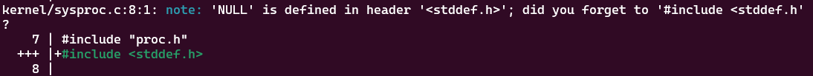
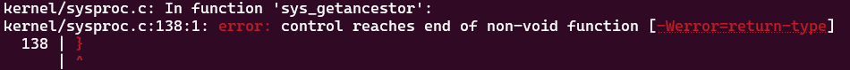
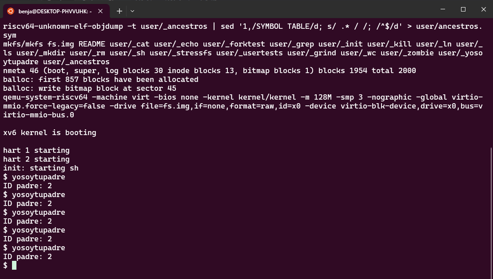
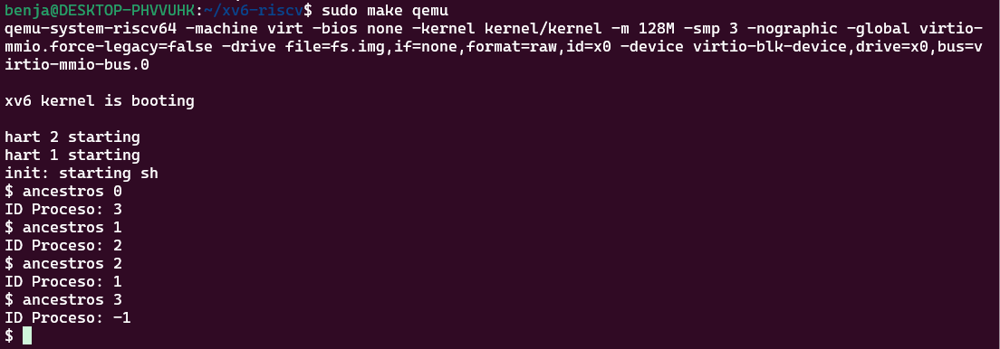

# Sistemas Operativos 2024/2 - Tarea 1 - Benjamín Herrera
El presente documento presenta el paso a paso para la implementación y modificación de llamadas al sistema xv6 evaluado en la tarea.

## Parte 1: Implementación Básica
### Pasos previos
1. Se creó y se cambió a una nueva rama exclusivamente para esta tarea: `git checkout -b Benjamin_Herrera_t1`
2. En la carpeta de `user`, se creó el archivo (de momento vacío) `yosoytupadre.c`, el cual corresponderá al nuevo programa ejecutable que albergará la nueva llamada al sistema a ser creada (`int getppid(void)`).

### Creación de la llamada
Previamente, es posible observar que el archivo `proc.h` (`/kernel`) declara la estructura de los procesos del sistema xv6. Es posible observar que tiene el parámetro `pid`, el cual almacena la ID del proceso actual en un valor entero, como también un puntero `*parent`, indicando la estructura del proceso padre.

1. Añadimos una nueva definición de llamada de sistema. Esto se realiza en el archivo `user.h` (`/user`), donde también se pueden observar el resto de llamadas al sistema por defecto que trae consigo xv6. Se añade entonces en la línea 25: `int getppid(void)`.

2. El archivo `usys.pl` es el responsable de generar el archivo `usys.S`, el cual contiene los esbozos de las llamadas al sistema de xv6. Se creó una nueva para `getppid` en la línea 39.

3. Volviendo a la carpeta del kernel, en el archivo `syscall.h` se creó una nueva entrada correspondiente a la llamada de sistema que estamos creando, bajo el número `22`. Este número debe ser único.

4. En el archivo `syscall.c`, se añadieron las líneas `extern uint64 sys_getppid(void);` (104) y `[SYS_getppid] sys_getppid,` (130). De esta forma se implementa la lógica asociada a la llamada al sistema asociada a `getppid` y nos aseguramos que el sistema ejecute lo esperado.

5. Por último, en el archivo `sysproc.c`, es posible apreciar el código de las llamadas a sistema. `getpid` (18-22) realiza `return myproc()->pid;`, por lo que para nuestra llamada `getppid` basta con añadir la línea `return myproc()->parent->pid;` (95-99) con tal de obtener la ID del proceso padre.

### Puesta en marcha
1. Volvemos al archivo `yosoytupadre.c`, el cual será nuestro programa ejecutable que permitirá probar la llamada al sistema previamente creada. Añadimos los archivos necesarios para compilarlo, y se escribe un código simple que permita visualizar en pantalla el funcionamiento del programa.
2. Se modifica el `Makefile` del kernel, añadiéndole la línea `	$U/_yosoytupadre\` (142) con tal de que se construya el nuevo programa ejecutable.
3. Se ejecuta `make clean` y luego `make` para compilar el kernel de xv6 con los cambios realizados en esta tarea.
4. Se ejecuta `make qemu` y se prueba el programa creado.

#### Comentarios

* Inicialmente, no aparecía el programa `yosoytupadre` por medio de la ejecución del comando `ls` o al intentar ejecutar directamente por la consola de xv6. Esto se debió ya que no había realizado la instrucción descrita en el paso 2 (había llevado a cabo los pasos 1-3-4).

## Parte 2: Implementación Avanzada
### Creación de la llamada
1. Se añadió en el archivo `user.h` la línea `int getancestor(int);` (26)
2. Se añadió en el archivo `usys.pl` la línea `entry("getancestor");` (40)
3. Se asignó en el archivo `syscall.h` a `#define SYS_getancestor` el número `23`.
4. En el archivo `syscall.c` se añadieron las líneas `extern uint64 sys_getancestor(void);` (105) y `[SYS_getancestor] sys_getancestor` (132).
5. En el archivo `sysproc.c` se escribió el código requerido para la función (Véase la sección Comentarios más abajo para ver algunas dificultades encontradas).
6. Se creó un nuevo archivo llamado `ancestros.c`, cuya funcionalidad es la misma de `yosoytupadre.c`, ya que es el programa ejecutable para corroorar el funcionamiento de la llamada al sistema. **Se asume que el usuario ingresará solo números al hacer uso de este programa.**
7. Se añadió el programa previo al archivo `Makefile`. Luego, se ejecutan los comandos `make clean` y `make` para compilar nuevamente el kernel con los cambios realizados.
8. Se ejecuta `make qemu` y se prueba el programa creado.

#### Comentarios
1. Durante el paso 5, la compilación tiró un error respecto a la utilización de `NULL` en C. Sin embargo, sólo me había olvidado de incluir `stddef.h`, módulo que hace uso de esto.

2. También durante el paso 5 y luego de haber solucionado lo previamente descrito, ocurrió un error respecto a lo que retornaba la función. Esto se debía ya que la función no estaba desarrollada para los casos donde el número no fuera 0, 1 o 2. Para ello, se agregó una condición `else` en el bloque condicional.

## Pruebas de funcionamiento

